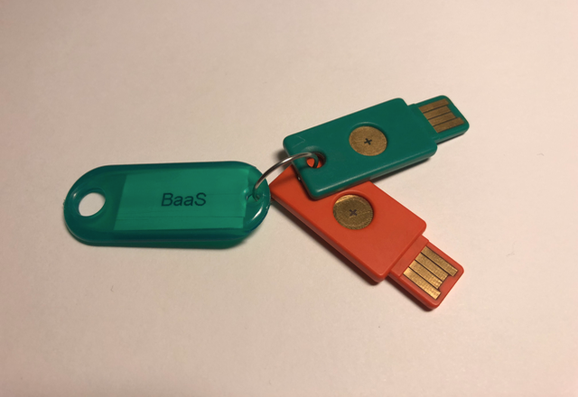

% BaaS and secure backups
% Pettai / SUNET / 2018 / v0.0.1


Introduction to BaaS
====================

The general documentation for BaaS is hosted on SafeSprings web

See https://docs.safespring.com/backup/getting-started/

Installation
============

The new Debian/Ubuntu way
-------------------------

This is the new model for distribution & keeping the the BaaS client software
up-to-date. It's currently in test phase, so some information in here will
probably change in a near future...

Add the new BaaS apt test repo

```
# echo "deb https://repo.cloud.ipnett.com/debian `lsb_release -cs` latest" \
	| tee /etc/apt/sources.list.d/cloud.ipnett.list
deb https://repo.cloud.ipnett.com/debian stretch latest
```

(Where `lsb_release -cs` typically is the OS release name, eg. xenial etc.)

Add the GPG-key for the apt repo

```
# curl -o cloud.ipnett.gpg https://repo.cloud.ipnett.com/debian/pubkey.gpg
  % Total    % Received % Xferd  Average Speed   Time    Time     Time  Current
                                 Dload  Upload   Total   Spent    Left  Speed
100  1695  100  1695    0     0   7957      0 --:--:-- --:--:-- --:--:--  7995
# apt-key add cloud.ipnett.gpg
OK
# apt update
Ign:1 http://deb.debian.org/debian stretch InRelease
Hit:2 http://deb.debian.org/debian stretch-updates InRelease
Hit:3 http://deb.debian.org/debian stretch Release
Hit:5 http://security.debian.org stretch/updates InRelease
Ign:6 https://repo.cloud.ipnett.com/debian stretch InRelease
Hit:7 https://repo.cloud.ipnett.com/debian stretch Release
Reading package lists... Done
Building dependency tree
Reading state information... Done
```

Install the BaaS client from the newly added apt repo

```
# apt-get install safespring-baas-setup
Reading package lists... Done
Building dependency tree
Reading state information... Done
[...lot of output follows...]
```

Finally, configure/upload TSM configuration files (dsm.opt & dsm.sys),
and put them in the /opt/tivoli/tsm/client/ba/bin/ directory

The TSM Client scheduler
------------------------

On systems with systemd you should also configure so the scheduler (dsmcad),
is started automatically during boot time.

```
# rm /etc/init.d/dsmcad
# cp /opt/tivoli/tsm/client/ba/bin/dsmcad.service /etc/systemd/system/
# chmod +x /etc/systemd/system/dsmcad.service
```

And reload the systemd configuration

```
# systemctl daemon-reload 
# systemctl start dsmcad.service
```

Initial bootstrap of the BaaS client

```
# dsmc
IBM Spectrum Protect
Command Line Backup-Archive Client Interface
  Client Version 8, Release 1, Level 4.0
  Client date/time: 2018-02-28 13:08:05
(c) Copyright by IBM Corporation and other(s) 1990, 2017. All Rights Reserved.

Node Name: MYNEWTSMCLIENT
Please enter your user id <MYNEWTSMCLIENT>: <press enter>

Please enter password for user id "MYNEWTSMCLIENT": <-- enter client password

Password updated.

Session established with server TSM1: Linux/x86_64
  Server Version 7, Release 1, Level 7.000
  Server date/time: 2018-02-28 14:08:40  Last access: 2018-02-28 14:08:40

Protect>
```


Setting up client-side encryption of the backups
================================================

During client provisioning from the portal or using the API,
you need to enable the encryption option. This can be done afterwards too,
but it has to be done before the initial backup is executed.
(Note that this enabling encryption automatically makes dedup/compression moot)

In your dsm.sys configuration file, you need to be sure the following exists:

```
Encryptiontype aes256
PASSWORDACCESS     GENERATE
ENCRYPTKEY SAVE
```

(By default TSM currently uses aes128 for Client-side encryption)

You can also find more information in the BaaS documentation
https://docs.safespring.com/backup/howto/encrypted/

Include/exclude directories from encryption
-------------------------------------------

If encryption is enabled and you don't specify a policy, everything dsmc backs
up should be encrypted on the client-side, before it's sent to the TSM-server.
What to encrypt, backup or not can be specified in dsm.sys. A minimal backup and
encryption configuration could look something like this:

```
  *which folder(s) to include and encrypt
  EXCLUDE "/.../*"
  INCLUDE.ENCRYPT "/etc/.../*"
  INCLUDE.ENCRYPT "/var/.../*"
  EXCLUDE "/var/cache/cosmos/.../*"
  INCLUDE "/some/other/dir/.../*"
```

Initialize the client-side encryption key
-----------------------------------------

The client-side encryption key is initialized at the first backup of files
that should be encrypted. You also need a passphrase for bootstrapping the
client-side encryption. Note that you will need this passphare if you ever
need to restore files, so don't write a too long one.
(Something similar to 'openssl rand -base64 12' should be okay.)

To bootstrap the client-side encryption for the above example configuration,
you can simply do:

```
# dsmc i /etc
IBM Spectrum Protect
Command Line Backup-Archive Client Interface
  Client Version 8, Release 1, Level 4.0
  Client date/time: 2018-02-28 13:58:46
(c) Copyright by IBM Corporation and other(s) 1990, 2017. All Rights Reserved.

Node Name: MYNEWTSMCLIENT
Session established with server TSM1: Linux/x86_64
  Server Version 7, Release 1, Level 7.000
  Server date/time: 2018-02-28 14:58:47  Last access: 2018-02-28 14:08:47


Incremental backup of volume '/etc'

--- User Action is Required ---
File: /etc requires an encryption key.


Select an appropriate action
  1. Prompt for encrypt key password
  A. Abort this operation
Action [1,A] : 1 <enter>

Enter encryption key password: <--- enter a passphrase <enter>
Confirm encryption key password: <--- reenter the passphrase <enter>
ANS1898I ***** Processed       500 files *****
ANS1898I ***** Processed     1,000 files *****

[...]

Successful incremental backup of '/etc'


Total number of objects inspected:       16,376
Total number of objects backed up:           77
Total number of objects updated:              0
Total number of objects rebound:              0
Total number of objects deleted:              0
Total number of objects expired:              0
Total number of objects failed:               0
Total number of objects encrypted:           77
Data encryption type:               256-bit AES

[...]
```

Storing the encryption passphrase securely
------------------------------------------

The passphare just added for the client-side encryption should stored,
so its not lost. If you loose it, there is no way to retrieve the files from
the TSM-server. 

To store it securely, put the passphase in a file and encrypt it using GPG.
You need the SUNET BaaS backup keys (BBD1CBB7F231EC19 and D926048A3259068D) 
for encrypting the file.

```
# gpg --import BBD1CBB7F231EC19.asc D926048A3259068D.asc 
gpg: key BBD1CBB7F231EC19: "SUNET BaaS backup key 1 (SUNET BaaS backup key 1)" \
not changed
gpg: key D926048A3259068D: "SUNET BaaS backup key 2 (SUNET BaaS backup key 2)" \
not changed
gpg: Total number processed: 2
gpg:               imported: 2
# gpg --encrypt --recipient BBD1CBB7F231EC19 --recipient D926048A3259068D \
  --trust-model always dsm.secret
```

And copy the GPG-encrypted file in nunoc-ops, and place it in the clients 
overlay directory, under the etc/dsm directory hierachy 
(eg. nunoc-ops/bionicbeaverbastard.sunet.se/overlay/etc/dsm/)

Don't forget to check in & commit the .gpg file in nunoc-ops!


Disaster recovery, how to retreive the encryption passphrase
------------------------------------------------------------

The GPG-keys for unencrypting the passphrase are stored on two Yubikey 4K.


You can request one of them from the Security Officer if you need to recover
the passphrase needed for restoring files.

